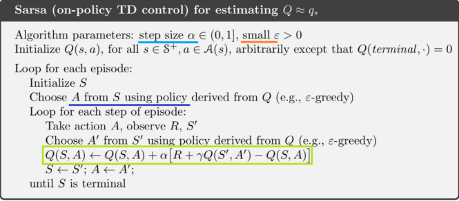

## SARSA in Reinforcement Learning
### Overview
SARSA (State-Action-Reward-State-Action) is an on-policy reinforcement learning algorithm that updates the action-value function based on the action actually taken by the agent, making it distinct from the off-policy Q-Learning algorithm. In SARSA, the agent learns the value of the policy it is following by interacting with the environment and continuously updating its Q-values based on the state-action pairs it encounters.

### Key Concepts

* On-Policy Learning:

SARSA learns the Q-values directly from the policy being executed by the agent. It updates the Q-value using the action chosen by the current policy.
Update Rule:

The Q-value update rule for SARSA is:

* Policy:

The policy can be either deterministic or stochastic. An example of a common policy used is the ε-greedy policy, which balances exploration and exploitation by choosing a random action with probability ε and the best-known action with probability 1−ϵ.

* Learning Rate (α) and Discount Factor (γ):

The learning rate 𝛼 controls how much new information overrides old information. The discount factor 𝛾 determines the importance of future rewards.

### Benefits

**1. On-Policy Nature:** Since SARSA updates its Q-values using the policy's actions, it tends to learn more accurately in environments where the policy being followed is crucial.

**2. Safety in Learning:** SARSA can be safer than Q-Learning in certain scenarios because it incorporates the actual policy's behavior, potentially avoiding overly optimistic value estimates.

### Contact

If you have any questions or comments, feel free to contact me on [Email](mailto:achadharma333@gmail.com)

